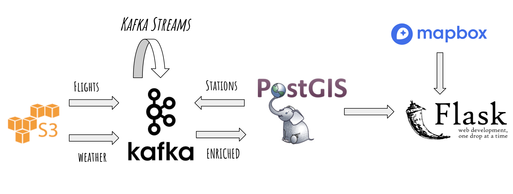

# SafeJourney
Real-time data pipeline platform to track flight status along with weather updates 

[Link] (bit.ly/safejourney-slides)

## Introduction

Building the data pipeline for a flight tracker application to analyze the data engineering challenges involved.  Flight status data will be used along with NOAA weather dataset to provide parallel updates on weather and flight status. End users - Airport ground station officials, pilots and anyone who wants to check for flight status updates and where exactly the flight is affected by weather

## Architecture

## Dataset

NOAA GSOD dataset from Amazon S3
 
OpenSky Flight status dataset

## Engineering challenges

- Joining two real-time streams of data
- Finding the closest weather station for a given flight
- Handling frequency difference between the 2 streams

## Trade-offs

- Using Postgres to store enriched stream data since PostGIS was needed for geo-spatial capabilities

## Future Work

- Predict Weather conditions for future flights based on historical data
- Experiment with alternatives for PostGIS geo-spatial search
